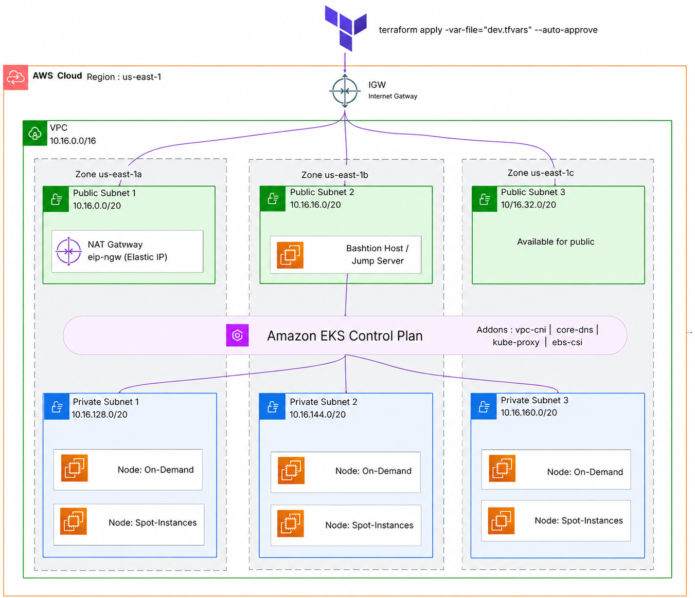

# Memories Notes App 

A production-ready, full-stack web application built with the MERN stack (MongoDB, Express, React, Node.js) and engineered with modern DevOps practices. This repository demonstrates end-to-end cloud infrastructure provisioning, containerized multi-stage pipelines (CI/CD), GitOps continuous delivery, and full-stack observability.

Live Preview: [Click here to preview](https://memories-note-app.vercel.app/)

---

## Table of Contents
1. [Architecture Overview](#architecture-overview)
   - [AWS Cloud Infrastructure (Terraform)](#1-aws-cloud-infrastructure-terraform)
   - [Application Delivery & Observability Architecture](#2-application-delivery--observability-architecture)
2. [Project Folder Structure](#project-folder-structure)
3. [Component Breakdown](#component-breakdown)
4. [Tech Stack & Technologies](#tech-stack--technologies)
5. [Getting Started](#getting-started)
   - [Prerequisites](#prerequisites)
   - [Local Development Setup](#local-development-setup)
   - [Running via Docker Compose](#running-via-docker-compose)
6. [Infrastructure Provisioning (Terraform)](#infrastructure-provisioning-terraform)
7. [Kubernetes & GitOps Deployment](#kubernetes--gitops-deployment)
8. [Observability & Monitoring](#observability--monitoring)
9. [CI/CD Pipelines](#cicd-pipelines)
10. [License](#license)

---

## Architecture Overview

This project is divided into two primary architectural dimensions: IaC (Infrastructure as Code) provisioning on AWS and Application Delivery with continuous GitOps deployment and observability.

### 1. AWS Cloud Infrastructure (Terraform)

The system deploys a secure, scalable, and isolated network topology on AWS using Terraform.



#### Infrastructure Details:
- **VPC & Subnets**: A custom VPC configured across 3 Availability Zones (AZs) in `ap-south-1`. It includes 3 Public Subnets (configured with an Internet Gateway) and 3 Private Subnets.
- **NAT Gateway**: Deployed in a public subnet, enabling outbound internet traffic from private subnets for EKS worker nodes to pull container images, retrieve updates, etc.
- **EKS Cluster**: A managed Amazon Elastic Kubernetes Service (EKS) cluster deployed within the private subnets for high security.
- **Auto-Scaling Node Groups**:
  - **On-Demand Node Group**: Ensuring baseline workload capacity.
  - **Spot Node Group**: Providing cost-effective capacity scaling using AWS Spot Instances.
- **OIDC Provider**: Integrated for IAM Roles for Service Accounts (IRSA) to grant fine-grained permissions to Kubernetes pods.
- **Security Groups**: Custom rules restricting direct access to the control plane and only allowing secure HTTPS/HTTP traffic.

---

### 2. Application Delivery & Observability Architecture

This diagram details the full CI/CD delivery lifecycle, GitOps synchronization, and the observability stack.


#### Operational Workflow:
1. **Continuous Integration (CI)**:
   - Developers push code changes to GitHub.
   - **GitHub Actions** workflows (`frontend-ci.yaml`, `backend-ci.yaml`, and `terraform-ci.yaml`) and **Jenkins Pipelines** run tests, compile resources, and trigger multi-stage Docker builds.
   - Images are tagged and pushed to **Docker Hub**.
2. **Continuous Delivery (CD) via GitOps**:
   - **ArgoCD** is installed on the EKS cluster and configured using the **App of Apps** pattern.
   - It monitors the `k8s_configuration` and `argocd` directories. Any delta between the Git state and cluster state is automatically synchronized.
   - **ArgoCD Image Updater** tracks Docker Hub. When a new image is pushed, it automatically updates the Git manifests with the new tag, triggering an automated roll-out.
3. **Traffic Routing**:
   - External requests hit the **Nginx Ingress Controller**, which routes traffic to either the Frontend React service or the Backend Express API based on host rules.
4. **Stateful Storage**:
   - MongoDB is deployed inside EKS as a StatefulSet to guarantee stable network identifiers and durable storage via Persistent Volumes (PV) and Claims (PVC) provisioned on AWS EBS.
5. **Observability Stack**:
   - **Metrics**: A `prom-client` in the Node.js backend registers custom application and system metrics, which are scraped via a custom Prometheus `ServiceMonitor`.
   - **Logging**: Fluent-Bit parses and aggregates application logs, sending them to Elasticsearch/Grafana Loki.
   - **Tracing**: Node.js auto-instrumentation via OpenTelemetry exports distributed traces to a Jaeger instance in the `tracing` namespace.

---

## Project Folder Structure

Below is the file layout of the repository:

```text
Memories-a-note-app/
├── .github/                       # GitHub Actions workflows for CI/CD
│   └── workflows/
│       ├── backend-ci.yaml        # CI workflow for the Backend Node.js API
│       ├── frontend-ci.yaml       # CI workflow for the Frontend React App
│       └── terraform-ci.yaml      # Lint, plan, and validate Terraform code
├── architecture-diagrams/         # Architecture diagrams
│   ├── memoreis_app_600.drawio.png # Full App & GitOps delivery flow
│   └── memories-notes-app-aws-architecture-terraform.png # IaC AWS VPC/EKS layout
├── argocd/                        # GitOps / ArgoCD application configurations
│   ├── app_of_apps/               # Parent app-of-apps pattern definition
│   │   └── app-of-apps.yaml
│   ├── apps/                      # Sub-applications (frontend, backend, database)
│   │   ├── backend_app.yaml
│   │   ├── database_app.yaml
│   │   └── frontend_app.yaml
│   ├── image_updater/             # Automatic manifest updates on Docker Hub push
│   │   ├── github-cred.yaml
│   │   └── image-updater.yaml
│   ├── notifications/             # Email/SMTP alerting configs
│   │   ├── argocd-notifications.yaml
│   │   └── secret-smtp.yaml
│   ├── projects/                  # ArgoCD project definitions
│   │   └── project.yaml
│   └── ingress-nginx.yaml         # Ingress rules for accessing ArgoCD
├── frontend/                      # React SPA Client App
│   ├── src/                       # Source files (components, views, routing)
│   ├── public/                    # Static assets & public template
│   ├── Dockerfile                 # Production Multi-stage Dockerfile
│   ├── Dockerfile.development     # Development Dockerfile
│   ├── Dockerfile.production      # Production Dockerfile
│   └── nginx.conf                 # Internal Nginx router for routing client SPA
├── k8s_configuration/             # Kubernetes Manifests (Kustomize based)
│   ├── backend/                   # Deployment, Service, ConfigMap, Kustomization
│   ├── database/                  # StatefulSet, Service, PVC, Secrets (MongoDB)
│   ├── frontend/                  # Deployment, Service, ConfigMap, Kustomization
│   ├── ingress/                   # Ingress router defining paths to services
│   └── namespace.yaml             # Main application namespace
├── observibility/                 # Observability Stack Configuration
│   ├── logging/                   # Fluent-bit Logging configurations
│   ├── monitoring/                # Prometheus alerts, custom ServiceMonitor, AlertManager
│   └── tracing/                   # OpenTelemetry tracing configurations (Jaeger)
├── server/                        # Node.js / Express Backend REST API
│   ├── config/                    # Database connections and configs
│   ├── controllers/               # Route logic handlers
│   ├── helpers/                   # Utility and helper functions
│   ├── middleware/                # Authentication & Error Handling middleware
│   ├── models/                    # MongoDB schemas (Notes, Users)
│   ├── index.js                   # Application entrypoint
│   ├── instrumentation.js         # OpenTelemetry distributed tracing SDK configuration
│   ├── metrics.js                 # Prometheus client custom metrics exporter
│   ├── Dockerfile                 # Server Dockerfile
│   └── vercel.json                # Vercel serverless deployment config
├── shared-library/                # Jenkins Shared Library configurations
│   └── Jenkinsfile                # Template library for pipeline execution
├── Jenkinsfile                    # Main Jenkins pipeline definition
└── README.md                      # Documentation (this file)
```

---

## Component Breakdown

- **`frontend/`**: The frontend UI is a React client using Ant Design for UI elements, Tailwind CSS for custom utility layouts, and GSAP with Locomotive.js to deliver smooth animations and transitions.
- **`server/`**: The backend is an Express REST API connecting to MongoDB. It performs JWT authentication, routes CRUD requests for notes, and exports telemetry metrics and traces.
- **`terraform/`**: Fully parameterized terraform files that split configurations into reusable modules ([vpc.tf](file:///C:/Prakash/Projects/Memories-a-note-app/terraform/modules/vpc.tf), [eks.tf](file:///C:/Prakash/Projects/Memories-a-note-app/terraform/modules/eks.tf), [iam.tf](file:///C:/Prakash/Projects/Memories-a-note-app/terraform/modules/iam.tf)) for deploying a production-grade VPC and EKS cluster on AWS.
- **`k8s_configuration/`**: Employs Kustomize to organize resources dynamically without using heavy Helm structures. Separates Frontend, Backend, and MongoDB configurations while ensuring Secrets and ConfigMaps are decoupled.
- **`argocd/`**: Implements continuous deployment via GitOps. Features an "app of apps" template that bootstraps the frontend, backend, and database apps on the EKS cluster dynamically.
- **`observibility/`**: Includes PrometheusRules for automated SLA alerting (high CPU usage, pod restarts), custom ServiceMonitors to scrape API telemetry, OpenTelemetry tracer instrumentation to Jaeger, and Fluent-bit configs.

---

## Tech Stack & Technologies

### Frontend
- **React.js**: Front-end framework.
- **Tailwind CSS**: Utility-first CSS styling.
- **Ant Design (AntD)**: Clean UI component suite.
- **GSAP & ScrollTrigger**: Micro-animations and page scroll triggers.
- **Locomotive.js**: Smooth scroll effects.
- **React Router**: Client routing.

### Backend
- **Node.js & Express.js**: Server platform and REST routing.
- **MongoDB**: Schema-less database.
- **JWT (JSON Web Tokens)**: Authentication security.

### DevOps & Cloud Infrastructure
- **Amazon Web Services (AWS)**: Cloud Hosting (VPC, EKS, EBS, IAM).
- **Terraform**: Infrastructure-as-Code (IaC).
- **Docker**: Containerization.
- **Kubernetes**: Orchestration.
- **Kustomize**: Kubernetes manifest customization.
- **ArgoCD**: GitOps Git-to-Cluster Continuous Delivery.
- **Jenkins**: Continuous Integration (CI).
- **GitHub Actions**: Continuous Integration (CI).

### Observability & Telemetry
- **Prometheus & Grafana**: Metrics gathering, custom dashboards, and alerting.
- **OpenTelemetry (OTel)**: Distributed tracing instrumentation.
- **Jaeger**: Tracing visualizer.
- **Fluent-Bit**: Scalable log shipper.

---

## Getting Started

### Prerequisites
Make sure you have the following installed on your local workstation:
- **Node.js** (v18+)
- **npm** (Node Package Manager)
- **Docker & Docker Compose** (for running containerized locally)
- **MongoDB** (if running bare-metal locally)

### Local Development Setup

1. **Clone the repository**:
   ```bash
   git clone https://github.com/prakashghropade/Memories-a-note-app.git
   cd Memories-a-note-app
   ```

2. **Install local dependencies**:
   ```bash
   # Install server dependencies
   cd server
   npm install

   # Install client dependencies
   cd ../frontend
   npm install
   ```

3. **Set up environment variables**:
   Create a `.env` file in the `server` directory:
   ```env
   MONGO_URI=mongodb://localhost:27017/memories
   JWT_SECRET=your_jwt_secret_key_here
   PORT=3001
   ```

4. **Run the applications**:
   - In the `server` directory, start the backend:
     ```bash
     npm run dev
     ```
   - In the `frontend` directory, start the client UI:
     ```bash
     npm start
     ```
   The app will run locally on [http://localhost:3001](http://localhost:3001).

### Running via Docker Compose
To run the entire stack (Frontend, Backend, and MongoDB) inside containers locally:
```bash
docker-compose up --build
```
This commands builds the local dockerfiles and runs them in a shared network interface.

---

## Infrastructure Provisioning (Terraform)

The Terraform configuration lives inside the [terraform/eks](file:///C:/Prakash/Projects/Memories-a-note-app/terraform/eks) directory.

1. **Initialize Terraform**:
   ```bash
   cd terraform/eks
   terraform init
   ```

2. **Run Plan**:
   ```bash
   terraform plan -var-file="dev.tfvars"
   ```

3. **Apply Configuration**:
   ```bash
   terraform apply -var-file="dev.tfvars" --auto-approve
   ```

This will deploy the entire custom VPC, subnets, EKS, Node groups, and role mappings.

---

## Kubernetes & GitOps Deployment

Once the cluster is ready, connect your Kubernetes environment and deploy the application.

1. **Configure Kubeconfig**:
   ```bash
   aws eks update-kubeconfig --name dev-memories-app-cluster --region <your-region>
   ```

2. **Apply Local Kustomization (Manual deployment)**:
   ```bash
   kubectl apply -k k8s_configuration/
   ```

3. **Bootstrap GitOps (ArgoCD)**:
   Ensure ArgoCD is running in your cluster. Apply the "App-of-Apps" pattern:
   ```bash
   kubectl apply -f argocd/app_of_apps/app-of-apps.yaml
   ```
   ArgoCD will automatically download, provision, and maintain the state of the Frontend, Backend, and Database resources.

---

## Observability & Monitoring

The system automatically collects detailed metrics, logs, and distributed traces.

### 1. Prometheus Metrics Scrapes
The Express backend exports metrics at `/metrics` using `prom-client` (e.g., HTTP request duration histograms, request gauges). The Prometheus agent queries the endpoint defined in the `ServiceMonitor` in [serviceMonitor.yaml](file:///C:/Prakash/Projects/Memories-a-note-app/observibility/monitoring/serviceMonitor.yaml):
```bash
kubectl apply -f observibility/monitoring/serviceMonitor.yaml
```

### 2. OpenTelemetry & Distributed Tracing
Auto-instrumentation for the server is enabled through [instrumentation.js](file:///C:/Prakash/Projects/Memories-a-note-app/server/instrumentation.js). To check distributed traces, deploy Jaeger in your EKS cluster and access the UI. By default, traces are exported to:
`http://jaeger.tracing.svc.cluster.local:4318/v1/traces`

---

## CI/CD Pipelines

### 1. Jenkins CI Pipeline
The pipeline definition in the root [Jenkinsfile](file:///C:/Prakash/Projects/Memories-a-note-app/Jenkinsfile) triggers builds, runs Docker builds with environment arguments for `REACT_APP_API_URL`, tags the images, and pushes them to Docker Hub. It emails developers on success or failure.

### 2. GitHub Actions
Defined in [.github/workflows](file:///C:/Prakash/Projects/Memories-a-note-app/.github/workflows):
- [backend-ci.yaml](file:///C:/Prakash/Projects/Memories-a-note-app/.github/workflows/backend-ci.yaml): Lints, tests, and builds Backend image.
- [frontend-ci.yaml](file:///C:/Prakash/Projects/Memories-a-note-app/.github/workflows/frontend-ci.yaml): Lints, tests, and builds Frontend React image.
- [terraform-ci.yaml](file:///C:/Prakash/Projects/Memories-a-note-app/.github/workflows/terraform-ci.yaml): Validates configuration parameters and executes `terraform plan`.

---

## License

This project is licensed under the MIT License.
